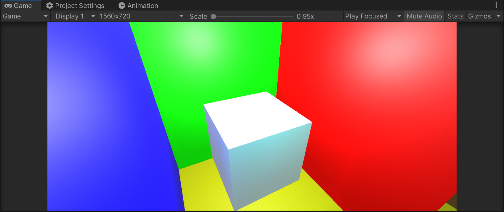

# VXGI-URP

Merge code from [Looooong](https://github.com/Looooong)/**[Unity-SRP-VXGI](https://github.com/Looooong/Unity-SRP-VXGI)**

* 目前仅支持URP-Deferred
* Support URP deferred render path only.
* 没有严格地进行移动平台的适配，仅完成了URP的植入。稍后会进行真机测试+优化。
* Coding and performance is horrible. Testing and optimizing is in the plan. 

* ComputeShader单线程计算压力有点大，建议不要使用中低端机器进行尝试。
* Due to incredible calculated amount in a single thread, DO NOT use low-end device to test.

### Next

* 支持URP-Forward
* Support URP-Forward
* 性能优化、性能测试
* Testing on mobile device  and Optimize

### What's More

* Lots of bugs! 